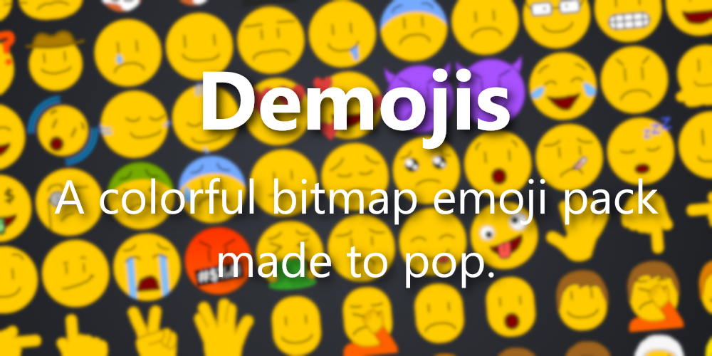

## Installation

```bash
npm install demojis
```

## Usage

```javascript
import demojis from "demojis";

// Get all emoji names
demojis.all; // ["smile", "frown", ...]

// Get all category names
demojis.getCategories(); // ["faces", "objects", ...]

// Get all emojis in a category
demojis.getByCategory("faces"); // ["smile", "wink", ...]

// Get a random emoji (optionally from a category)
demojis.getRandom();
demojis.getRandom("faces");

// Get a URL for an emoji image
demojis.getImage("smile"); // 256px (default)
demojis.getImage("smile", 64); // 64px
```

## Image Sizes

Four sizes are available: `32`, `64`, `128`, `256` (pixels). All images are PNGs.

## API

### `demojis.all`

Array of all emoji names, sorted alphabetically.

### `demojis.categories`

Object mapping category names to arrays of emoji names.

```javascript
{
  faces: ["smile", "zany", ...],
  symbols: ["x", "checkmark", ...],
  ...
}
```

### `getAll()`

Returns `demojis.all`.

### `getCategories()`

Returns an array of category name strings.

### `getByCategory(name)`

Returns the array of emoji names in that category, or `[]` if the category doesn't exist.

### `getRandom(category?)`

Returns a random emoji name. Pass a category name to limit to that category. Returns `null` if the category is empty or doesn't exist.

### `getImage(name, size?)`

Returns a URL string for the emoji image. Defaults to `256`px.

- **Node (ESM/CJS):** returns a `file://` URL pointing to the local image inside `node_modules`.
- **Browser (Vite, webpack, etc.):** returns a CDN URL from jsDelivr.

## Browser / Vite

Bundlers like Vite automatically use the browser entry point via the `browser` export condition, so you don't need to configure anything. Images are served from the jsDelivr CDN by default.

If you prefer to self-host the images, copy the `dist/images` folder into your project's public directory and call `setBaseUrl`:

```javascript
import demojis from "demojis";

demojis.setBaseUrl("/public/demojis");

demojis.getImage("smile", 64); // "/public/demojis/64/smile.png"
```

### `setBaseUrl(url)` _(browser only)_

Overrides the base URL used by `getImage`. Trailing slashes are stripped automatically.

## Module formats

| Condition | File              | Use case                          |
| --------- | ----------------- | --------------------------------- |
| `browser` | `dist/browser.js` | Vite, webpack, and other bundlers |
| `import`  | `dist/index.js`   | Node ESM (`import`)               |
| `require` | `dist/index.cjs`  | Node CJS (`require`)              |

## Unicode Equivalents

To see a list of Unicode equivalents for Demojis, check out [UNICODE.md](UNICODE.md).